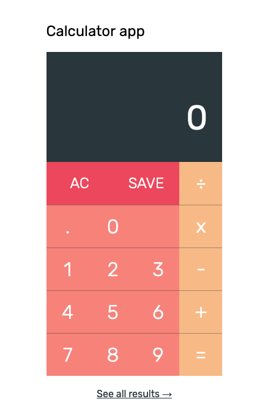

<h2 align="center">Calculator app<h2>

This is a tiny little calculator written in Vanilla JS and PHP.

  

[**✈️ Live demo**]()  
[**📊 Calculations page**]()

### Features:
- Performing calculations
- Saving results as CSV on the server
- Displaying results from CSV as HTML table

### Project setup:
- Clone this repository and install dependencies with `npm i`  
- Run `npm run dev` to start local dev server  
- Run `npm run build` to compile ready-to-deploy bundle to `dist` folder  
- Run `npm run server` to run local PHP server on `dist` folder

### Folder structure:
- `src` - all source files  
- `src/css` - scss styles  
- `src/css/style.scss` - SCSS entry point  
- `src/js` - all JavaScript files  
- `src/js/main.js` - JS entry point  
- `src/views` - template for html-webpack-plugin  
- `php` - all PHP files  
- `dist` - compiled production bundle  
- `webpack` - whole webpack config